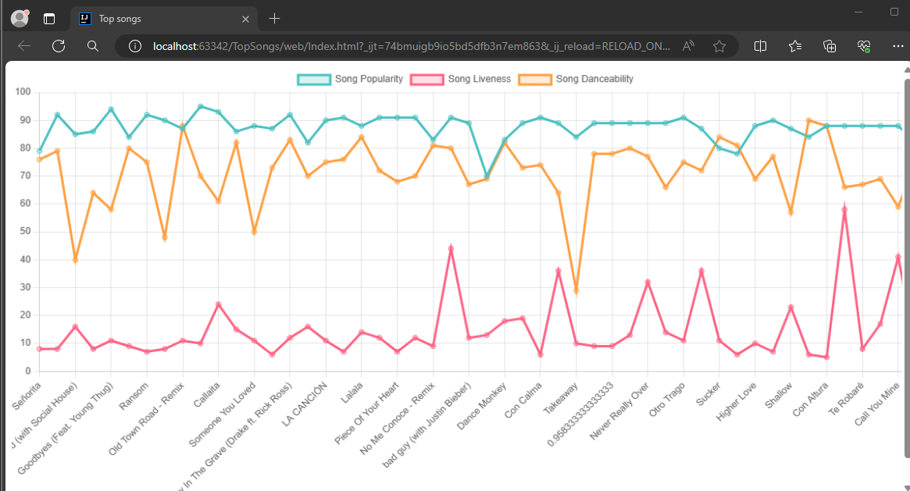

# Restful API with Spring Boot

This project is a RESTful API developed with Spring Boot. The API is built around a dataset from Kaggle for the Top 50 songs of 2019. The data is exposed through endpoints that allow clients to retrieve information about the songs.

The API provides data such as the song's popularity, liveness, and danceability. These attributes are then visualized in a line chart, allowing for an easy comparison between the different songs.

## API Endpoints[src](src)

The API provides the following endpoints:

- `GET /api/songs`: Returns a list of all the songs in the dataset.
- `GET /api/songs/{id}`: Returns the details of a specific song.

## Visualization

The visualization is implemented using Chart.js. The line chart plots the popularity, liveness, and danceability of the songs, providing a visual comparison of these attributes across the Top 50 songs of 2019.

## Technologies Used

- Spring Boot: Used for creating the RESTful API.
- PostgreSQL: Used as the database to store the songs data.
- Chart.js: Used for creating the line chart visualization.

## Setup and Running

To set up and run the project:

1. Clone the repository.
2. Update the `application.properties` file with your database credentials.
3. Run the `TopSongsApplication.java` file to start the application.
4. Access the API endpoints through `http://localhost:8080/api/songs`.
5. Open the `web/Index.html` file in a browser to view the visualization.

Please refer to the `README.md` file for more detailed instructions and additional information.